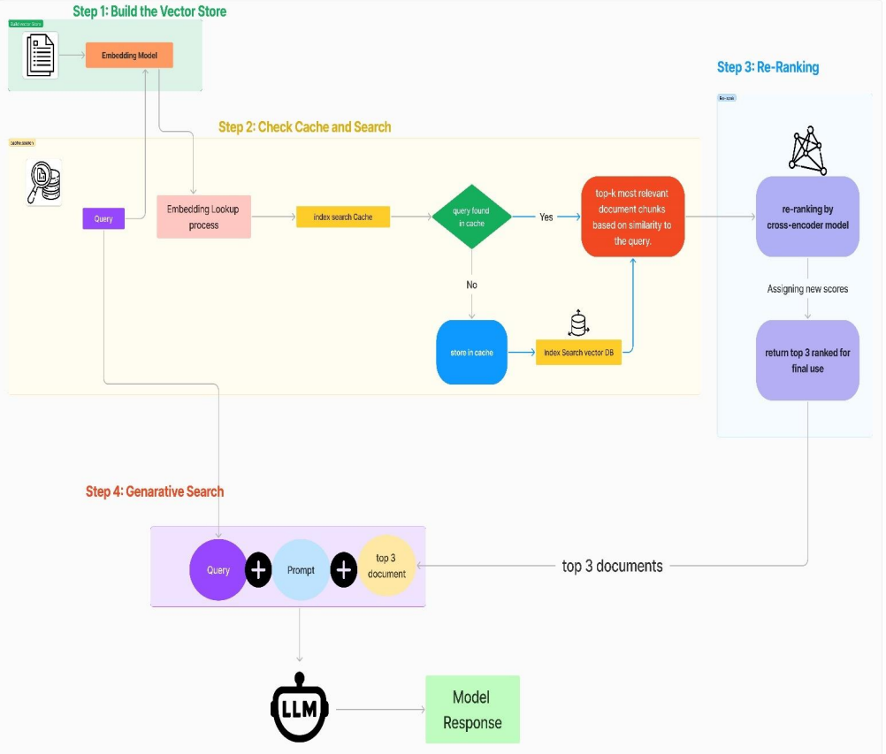

# `Building Effective Search Systems: HelpMateAI`

## `1. Background`
This project demonstrates the implementation of **HelpMateAI**, an advanced **Retrieval-Augmented Generation (RAG) search system** designed to answer questions from a long insurance policy document accurately and efficiently.

## `2. Problem Statement`
The goal of this project is to build a **robust generative search system** that effectively retrieves and generates responses from a **single long life insurance policy document**.

## `3. Document`
The policy document can be found in the repo

## `4. Approach`
The project consists of three key layers, each requiring various strategies and experiments to optimize the search system's effectiveness.

### `Embedding Layer`
- The **PDF document** needs to be **processed, cleaned, and chunked** efficiently.
- **Chunking strategy** significantly impacts retrieval quality. Multiple chunking techniques will be tested and compared.
- The choice of **embedding model** is crucial. Options include:
  - **OpenAI embedding models**
  - **SentenceTransformers models** from Hugging Face (e.g., `all-MiniLM-L6-v2`)

### `Search Layer`
- At least **three queries** will be designed to test the system's retrieval capability.
- Queries will be **embedded and searched** against the **ChromaDB vector database**.
- A **cache mechanism** will be implemented for optimized performance.
- A **re-ranking block** will be introduced using **cross-encoder models** from Hugging Face.

### `Generation Layer`
- The **final prompt design** is critical for producing accurate answers.
- The prompt must be **detailed, well-structured, and pass relevant information effectively**.
- **Few-shot examples** may be included to enhance the LLM-generated output.

## `5. System Layers`

### `Reading & Processing PDF File`
- **pdfplumber** will be used for **PDF parsing and text extraction**.
- It supports **tables, images, and structured data extraction**.
- Offers **visual debugging** features for better preprocessing.

### `Document Chunking`
- Since the document is large, **fixed-size chunking** will be implemented.
- Different chunking techniques will be tested to evaluate performance.

### `Generating Embeddings`
- The project will use **SentenceTransformers** with the **all-MiniLM-L6-v2** model for embedding generation.

### `Storing Embeddings in ChromaDB`
- The **ChromaDB vector database** will store the generated embeddings for efficient retrieval.

### `Semantic Search with Cache`
- A **cache collection layer** will be introduced to optimize search performance and reduce redundant computations.

### `Re-Ranking with a Cross-Encoder`
- **Re-ranking** enhances the **relevance of retrieved results** by scoring query-response pairs using a **cross-encoder model**.
- This step ensures that the **most contextually accurate** answers are prioritized.

### `Retrieval-Augmented Generation (RAG)`
- The **final retrieved results** will be **fed into GPT-3.5** along with the user query and an optimized prompt.
- The model will generate a **direct answer with citations** for improved reliability.

## `6. Summary`
This project integrates **advanced search techniques**, **embedding optimization**, and **LLM-based response generation** to build an **intelligent question-answering system** for long insurance policy documents.

---
## `7. Prerequisites`
Python 3.7+
Please ensure that you add your OpenAI API key to the empty text file named "OpenAI_API_Key" in order to access the OpenAI API.